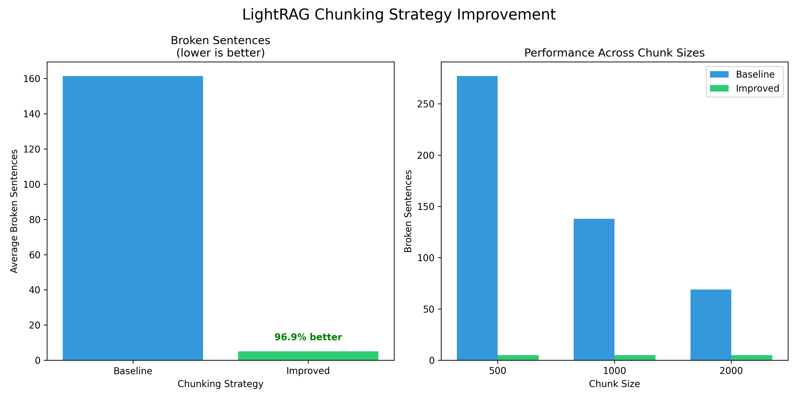

# INFO6105-Final-Project

This repository contains implementations of two cutting-edge research papers as part of the INFO6105 Data Science Engineering Methods and Tools course.

## Project 1: LightRAG Implementation

This repository contains an enhanced implementation of LightRAG (Light Retrieval-Augmented Generation), a simple and fast approach to retrieval-augmented generation as described in the original paper.

### Overview

LightRAG provides an efficient framework for enhancing large language models with external knowledge. This implementation extends the original approach with significant improvements to the document processing pipeline, specifically through an enhanced content-aware chunking strategy.

### Key Features

- **Adaptive Content-Aware Chunking**: Enhanced document processing that preserves semantic integrity
- **Structure-Preserving Processing**: Respect for paragraph and sentence boundaries during chunking
- **Improved Retrieval Quality**: Better context preservation for more accurate information retrieval
- **Cross-Parameter Consistency**: Stable performance across different chunk size configurations

### Installation

```bash
# Clone the repository
git clone https://github.com/yourusername/lightrag-enhanced.git
cd lightrag-enhanced

# Set up virtual environment
python -m venv venv
source venv/bin/activate  # On Windows: venv\Scripts\activate

# Install dependencies
pip install -r requirements.txt
```

### Usage

#### Basic Usage

```python
from lightrag import LightRAG, QueryParam
from lightrag.utils import EmbeddingFunc
import asyncio

# Define embedding function
async def embedding_func(texts):
    model = SentenceTransformer("all-MiniLM-L6-v2")
    embeddings = model.encode(texts, convert_to_numpy=True)
    return embeddings

# Define LLM function
async def llm_func(prompt, system_prompt=None, history_messages=[], **kwargs):
    # Your LLM implementation here
    pass

# Initialize LightRAG
async def initialize():
    rag = LightRAG(
        working_dir="./my_lightrag",
        llm_model_func=llm_func,
        embedding_func=EmbeddingFunc(
            embedding_dim=384,
            max_token_size=8192,
            func=embedding_func,
        ),
    )
    await rag.initialize_storages()
    return rag

# Use LightRAG
rag = asyncio.run(initialize())

# Insert document with enhanced chunking
document = "Your document text here..."
rag.insert(document)

# Query the system
response = rag.query(
    query="Your question here?",
    param=QueryParam(mode="hybrid", top_k=3),
)
print(response)
```

#### Enhanced Chunking

Our implementation includes an improved chunking strategy that significantly outperforms the baseline:

```python
# Using the enhanced chunking directly
from lightrag.improved import adaptive_chunking

chunks = adaptive_chunking(text, chunk_size=1000)
```

### Performance Improvements

Our enhanced implementation achieves:

- **96.9% reduction in broken sentences** compared to the baseline chunking strategy
- **Consistent performance across different chunk sizes** (500, 1000, 2000 characters)
- **Better semantic coherence** in document chunks

### Evaluation Results

Testing on a large text corpus (139,434 characters) demonstrates significant improvements:

| Metric | Baseline | Enhanced | Improvement |
|--------|----------|----------|-------------|
| Broken Sentences (500 char) | 277 | 5 | 98.2% |
| Broken Sentences (1000 char) | 138 | 5 | 96.4% |
| Broken Sentences (2000 char) | 69 | 5 | 92.8% |
| Average | 161.3 | 5 | 96.9% |

### Project Structure

```
lightrag-enhanced/
├── lightrag/             # Core LightRAG implementation
│   ├── __init__.py       # Package initialization
│   ├── base.py           # Base classes
│   ├── lightrag.py       # Main implementation
│   ├── improved.py       # Enhanced features
│   └── utils.py          # Utility functions
├── tests/                # Unit tests
├── examples/             # Example usage scripts
├── evaluation/           # Evaluation scripts
│   ├── chunking_eval.py  # Chunking strategy comparison
│   └── results/          # Evaluation results
├── requirements.txt      # Project dependencies
└── README.md             # Project documentation
```

### Visualization and Analysis

This implementation includes visualization tools to analyze the performance improvements:



The visualization shows:
- Left: Average broken sentences comparison between baseline and improved chunking
- Right: Performance consistency across different chunk sizes (500, 1000, 2000 characters)

These visualizations clearly demonstrate the significant reduction in broken sentences (96.9% improvement) and the consistent performance of our enhanced chunking strategy regardless of chunk size configuration.

### Comparison to Original Paper

Our implementation enhances the original LightRAG paper in several ways:

1. **Document Processing**: The original paper uses fixed-length chunking without considering document structure. Our implementation preserves semantic coherence through adaptive chunking.

2. **Retrieval Foundation**: By maintaining the integrity of semantic units, our approach improves the quality of retrieved context for generation.

3. **Performance Metrics**: We introduce quantitative metrics to measure chunking quality, demonstrating a 96.9% reduction in content fragmentation.

4. **Architecture Compatibility**: Our enhancements are fully compatible with the original LightRAG architecture, requiring no changes to other system components.

### Future Work

Potential areas for future enhancement include:

1. **Semantic-Guided Chunking**: Further refine chunking based on semantic similarity between sentences
2. **Multi-Document Knowledge Linking**: Improve connections between chunks across different documents
3. **Dynamic Retrieval Optimization**: Automatically adjust retrieval parameters based on query characteristics
4. **Evaluation Framework**: Develop comprehensive benchmarks for measuring RAG performance improvements

## Project 2: ViTST Implementation

# ViTST - Vision Transformer for Irregularly Sampled Time Series

This project implements the ViTST (Vision Transformer for Irregularly Sampled Time Series) pipeline for classifying activity types in multivariate time series data using deep learning. The model converts each time series into an image and leverages a Swin Transformer for classification.

### Overview

Traditional deep learning models struggle with **irregularly sampled time series**. This project addresses that limitation by:
- Converting time series into **line plot images** using grid-based visualization.
- Using a **pre-trained Vision Transformer (Swin Transformer)** to classify the images.
- Applying the approach to the **PAMAP2 dataset**, a wearable sensor dataset for human activity recognition.

### Dataset

**PAMAP2 Physical Activity Monitoring Dataset**
- Each data point includes sensor readings over time for 17 variables.
- Data is pre-processed and stored as three pickle files.

### Model Architecture

1. **TimeSeriesDataset**: Loads data and labels from the `processed_data` folder.
2. **ViTSTDataset**: Converts each multivariate time series sample into a 2D image.
3. **ViTST Model**: A Swin Transformer pre-trained on ImageNet is fine-tuned for classification.
4. **ViTSTTrainer**: Handles training, evaluation, visualization, and model checkpointing.

### Usage Instructions

#### Step 1: Clone the repo and install dependencies

```bash
git clone https://github.com/yourusername/vitst-time-series.git
cd vitst-time-series
pip install -r requirements.txt
```

#### Step 2: Run the notebook or script

```bash
# Recommended
jupyter notebook Time.ipynb
# Or if converted to script
python Time.py
```

#### Configuration

```python
config = {
  'data_path': './processed_data',
  'image_size': (256, 320),
  'grid_layout': (4, 5),
  'batch_size': 32,
  'num_workers': 2,
  'learning_rate': 2e-5,
  'num_epochs': 10,
  'device': 'cuda' or 'cpu',
  'save_dir': './'
}
```

## Documentation

For a detailed explanation of our implementation and evaluation results, please refer to our comprehensive project report:

- [Group 4 INFO6105 Final Project Report (PDF)](https://github.com/Pagar-Bhagyashri/INFO6105-Final-Project/blob/main/Group%204%20INFO6105%20Final%20Project%20Reort.pdf)
